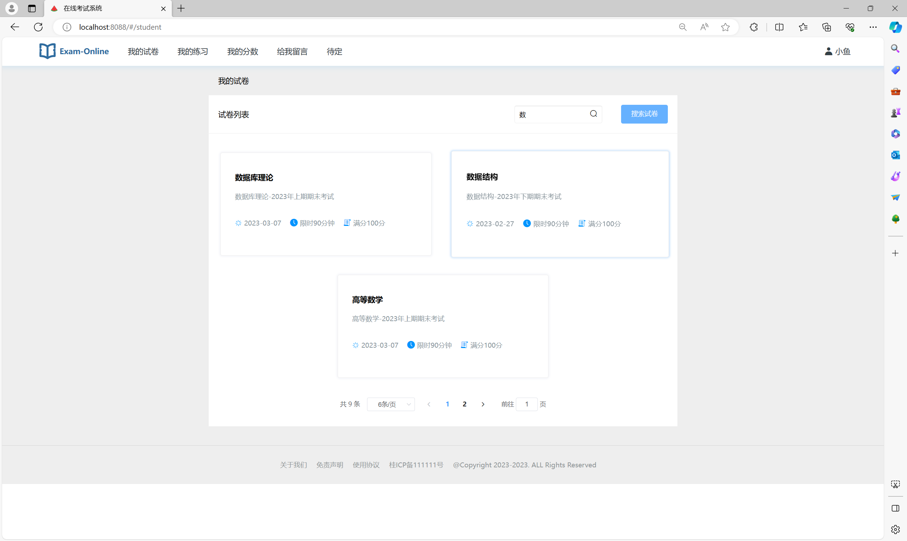
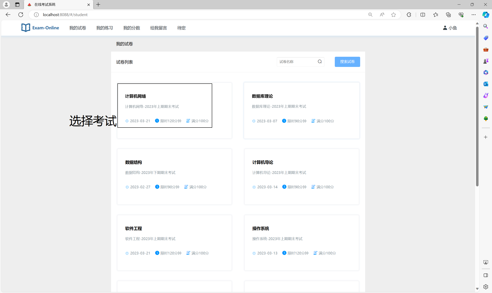
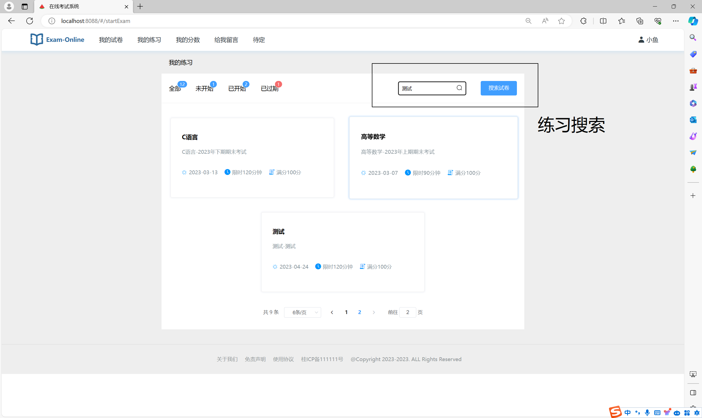
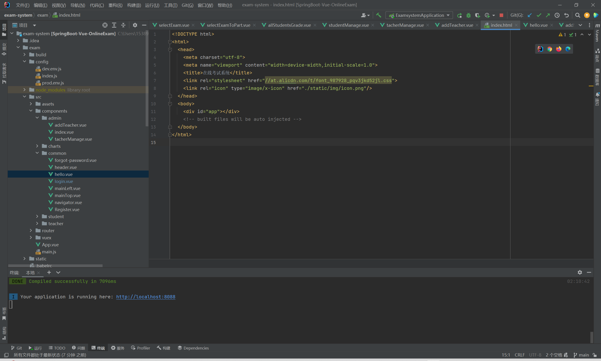
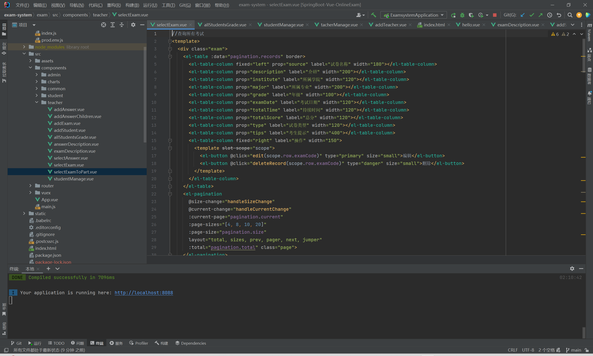
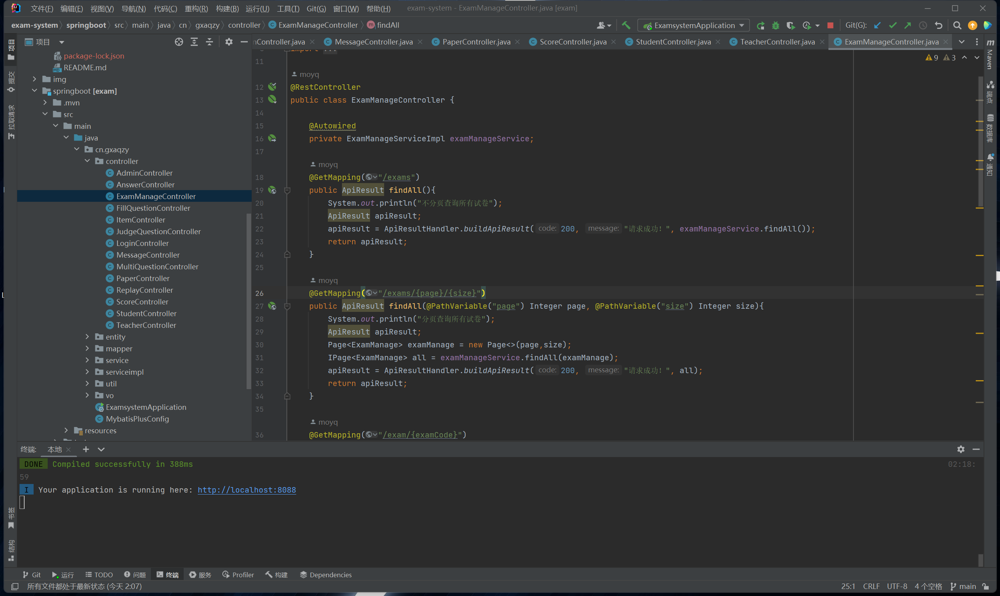

# 项目介绍：在线考试系统

## 项目背景

在线考试系统是一个旨在提供灵活的在线学习和考试解决方案的应用程序。该系统为管理员、老师和学生提供了多种功能，以支持学习、教育和考试过程。

## 目标

在线考试系统的主要目标是提供一个安全、易于使用和高效的平台，以进行各种类型的考试，包括练习、测验和正式考试。它旨在促进学生学习，帮助老师和管理员管理考试和评估学生表现。

## 关键功能

1. **用户登录**：支持管理员、老师和学生角色的登录，每个角色具有不同的权限。

2. **试卷列表**：显示可用的试卷列表，包括练习模式和正式考试模式。

3. **答题模块**：学生可以在指定时间内答题，系统会自动评分。

4. **练习模式**：学生可以选择特定主题或难度水平的练习，以提高他们的知识。

5. **留言模块**：学生可以向老师提问，老师可以回答疑问。

6. **后台管理**：管理员可以管理试卷、练习、学生和老师的信息。

7. **学生成绩**：记录学生的考试成绩和练习进度。

8. **数据管理**：支持试卷、练习、学生、老师和成绩的增删改查操作。

## 技术栈

- 后端开发：Spring Boot 框架
- 前端开发：Vue.js + element
- 数据库：MySQL 或其他关系型数据库
- 身份验证和权限管理：Spring Security
- 前端 UI 组件库：Element UI 或其他合适的组件库

在线考试系统是一个有着广泛应用前景的项目，它可以在教育和培训领域发挥重要作用。

# 页面截图

## 登录页

## 学生端

### 首页

### 考试

### 留言

### 修改密码

## 教师·管理员端

